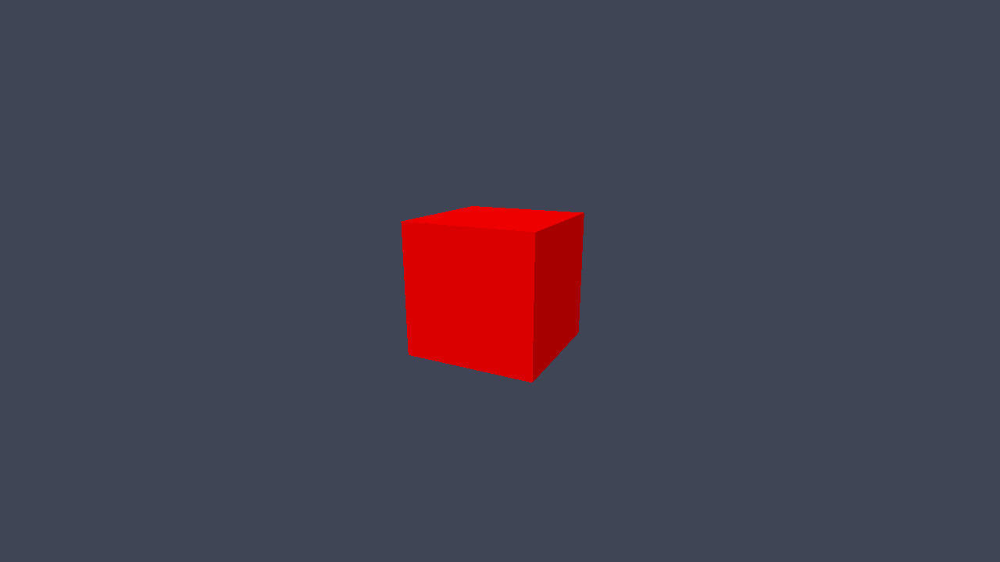
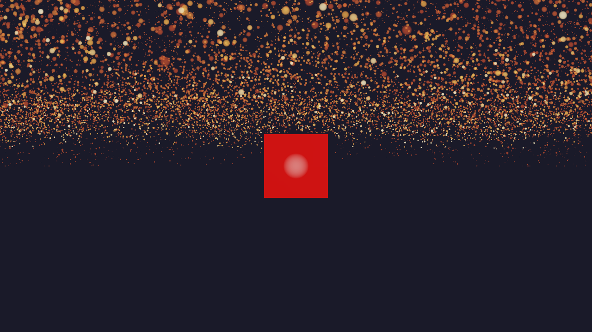
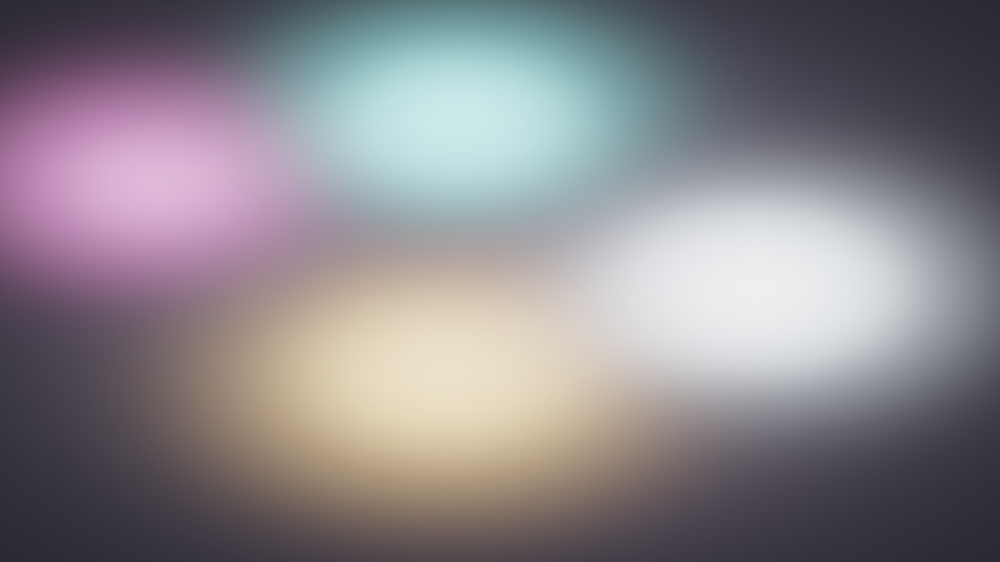
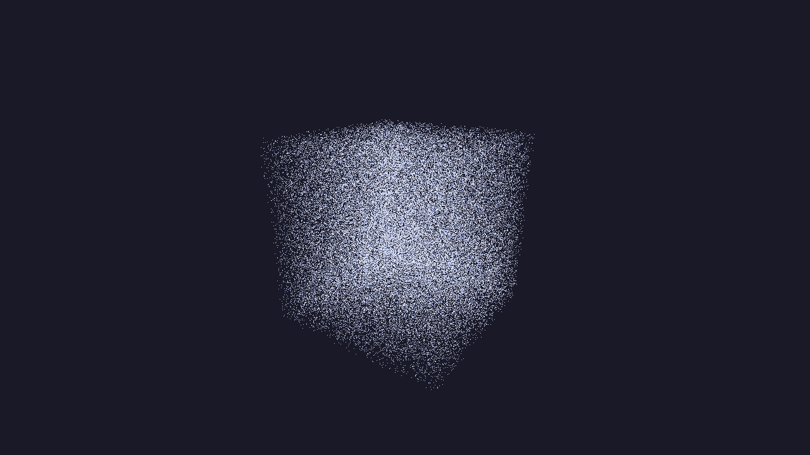
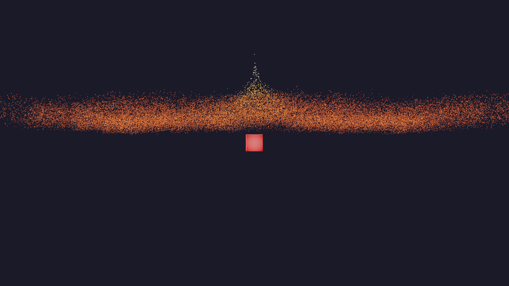
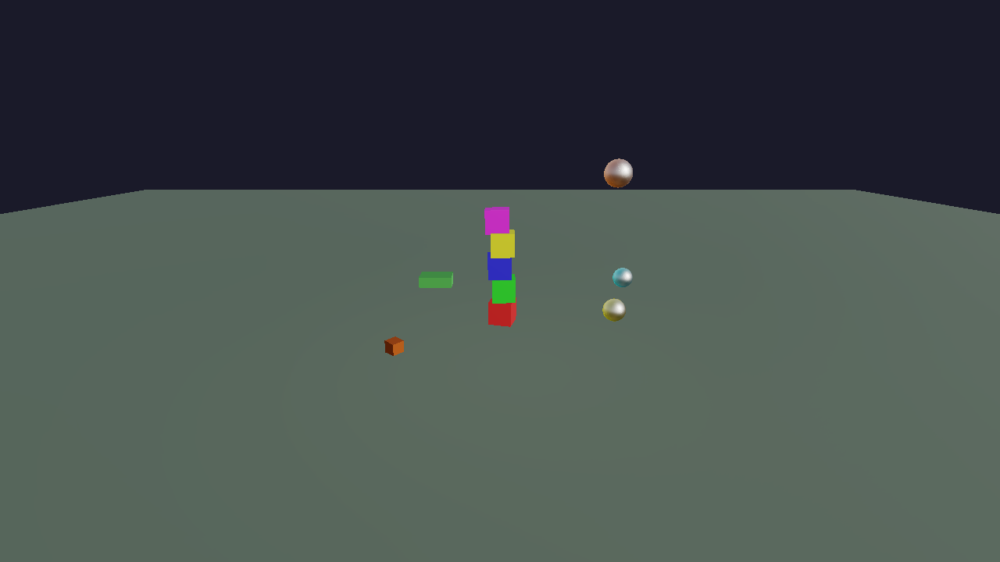
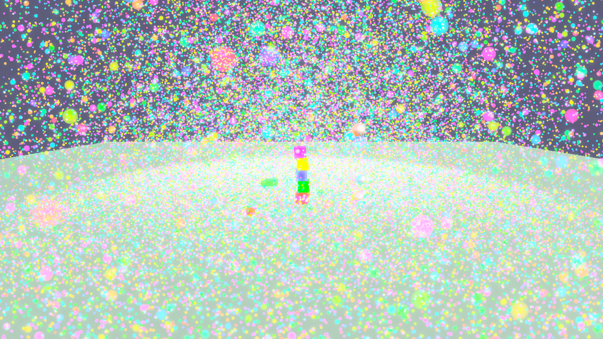
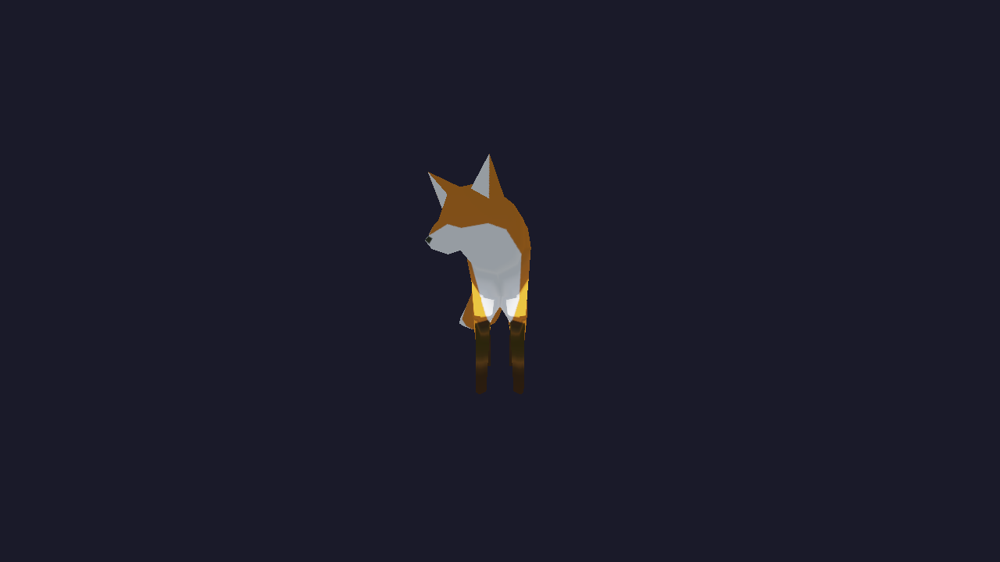

# C++ examples

Configure with `BUILD_EXAMPLES=ON` following [BUILDING.md](../../BUILDING.md), then build a target below. Run from its **source directory** so JSON and shader paths resolve. Ninja places executables under the corresponding build-tree directory; Visual Studio adds a configuration directory such as `Release`.

| Source directory | CMake target | Demonstrates |
|---|---|---|
| [api/facade_test](../../examples/cpp/api/facade_test) | `FacadeTest` | Facade application and bundled-box fallback |
| [api/instancing_test](../../examples/cpp/api/instancing_test) | `InstancingTest` | Shared geometry, hierarchy, capture; `--selftest` available |
| [rendering/declarative_sponza_test](../../examples/cpp/rendering/declarative_sponza_test) | `DeclarativeSponzaTest` | Deferred PBR/IBL |
| [rendering/bloom_test](../../examples/cpp/rendering/bloom_test) | `ShoonyakashaBloomTest` | Multipass bloom |
| [compute/particle_test](../../examples/cpp/compute/particle_test) | `ShoonyakashaParticleTest` | Compute particles |
| [compute/particle_flow_example](../../examples/cpp/compute/particle_flow_example) | `ParticleFlowExample` | Particle parameters and target saving |
| [compute/ssbo_data_flow_example](../../examples/cpp/compute/ssbo_data_flow_example) | `SSBODataFlowExample` | Buffer initialization, sharing, readback, and files |
| [physics/physics_test](../../examples/cpp/physics/physics_test) | `PhysicsTest` | Native ECS rigid bodies and colliders |
| [physics/pbr_physics_particles](../../examples/cpp/physics/pbr_physics_particles) | `PbrPhysicsParticles` | Combined simulation and rendering |
| [animation/skinned_mesh_test](../../examples/cpp/animation/skinned_mesh_test) | `SkinnedMeshTest` | Skinning and playback |

Example build command from the repository root:

```sh
cmake --build build --config Release --target FacadeTest
```

The shared CMake shader helper compiles each target's shaders. Shared assets use the asset-root resolver; pipelines and shaders still depend on the source working directory. See [asset availability](../../assets/README.md) and [feature catalog](../../examples/README.md).

## Runtime previews

Native frame captures using bundled assets. See [capture recipes and asset choices](../images/examples/README.md) for refresh instructions. Click an image to view it at full resolution.

### Facade API (`facade_test`)

<a href="../images/examples/cpp/facade_test.png"></a>

The bundled `Box.gltf` fallback, with the camera moved closer. The normal example uses Sponza when it is installed.

### Instancing (`instancing_test`)

<a href="../images/examples/cpp/instancing_test.png"></a>

Shared box geometry with independent transforms and materials, using the bundled instanced-box scene.

### Declarative PBR/IBL (`declarative_sponza_test`)

<a href="../images/examples/cpp/declarative_sponza_test.png"></a>

The Sponza example's JSON pipeline rendered with bundled `Box.gltf`, substituted only in the capture build. The normal example requires the separately downloaded Sponza scene; it has no automatic box fallback.

### Bloom (`bloom_test`)

<a href="../images/examples/cpp/bloom_test.png"></a>

Animated procedural HDR orbs with bright extraction, blur, and bloom compositing. The soft shapes are the example's actual output; no model assets are required.

### Compute particles (`particle_test`)

<a href="../images/examples/cpp/particle_test.png"></a>

An active frame of the standalone GPU simulation with 100,000 particles. Particle data is generated by the example.

### Particle flow (`particle_flow_example`)

<a href="../images/examples/cpp/particle_flow_example.png"></a>

Dynamic particle flow and attractors, using the bundled-box fallback instead of optional Sponza.

### SSBO data flow (`ssbo_data_flow_example`)

<a href="../images/examples/cpp/ssbo_data_flow_example.png"></a>

Particles initialized and shared through SSBOs, with bundled `Box.gltf`. This capture uses the normal initialization path, without loading a previously saved buffer.

### Physics (`physics_test`)

<a href="../images/examples/cpp/physics_test.png"></a>

Procedural rigid bodies one second after starting physics with **P**. No downloaded models are needed.

### PBR, physics, and particles (`pbr_physics_particles`)

<a href="../images/examples/cpp/pbr_physics_particles.png"></a>

The combined scene one second after **P** starts physics and particle simulation. Geometry is procedural; lighting uses the bundled environment.

### Skeletal animation (`skinned_mesh_test`)

<a href="../images/examples/cpp/skinned_mesh_test.png"></a>

Bundled `Fox.glb`, captured during playback of the first animation clip with the default camera.
