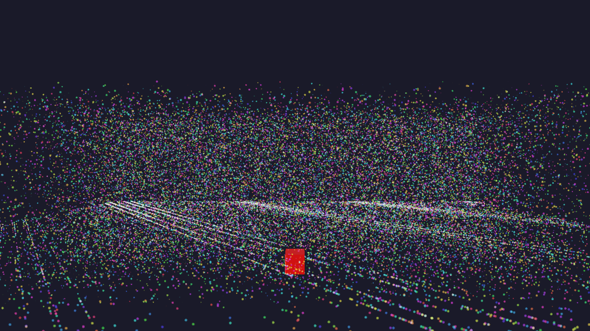
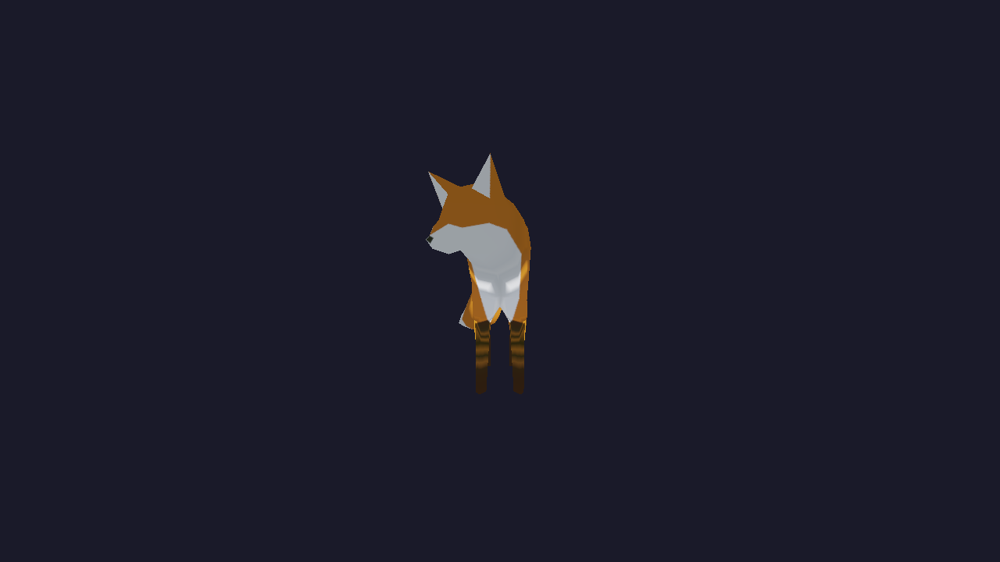
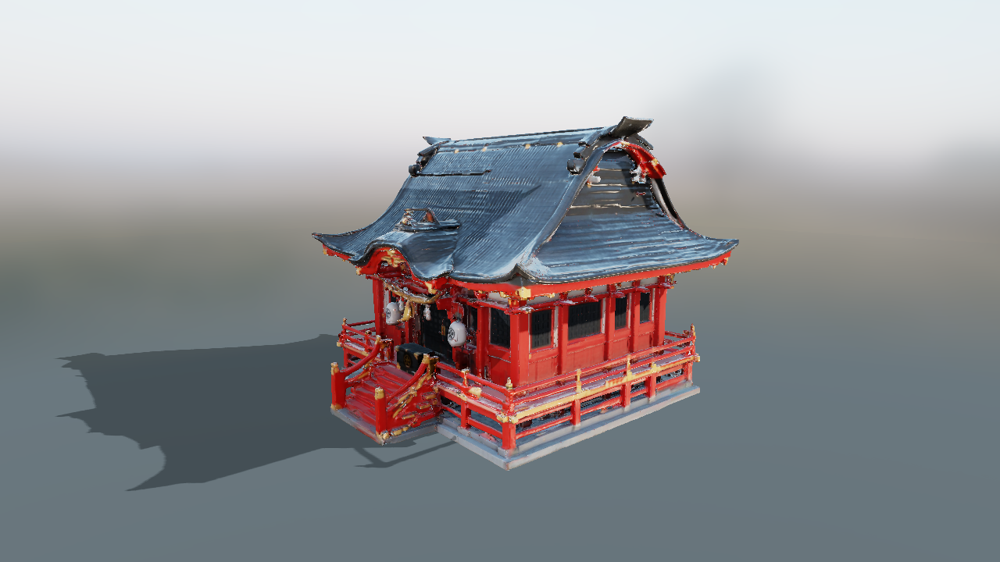
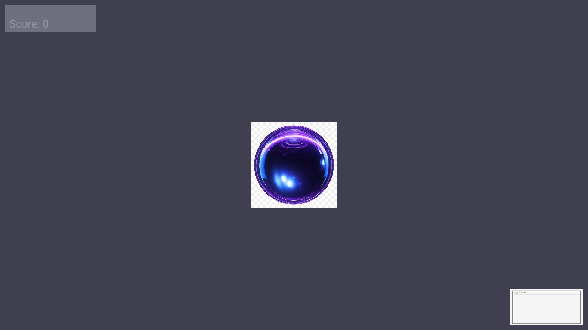
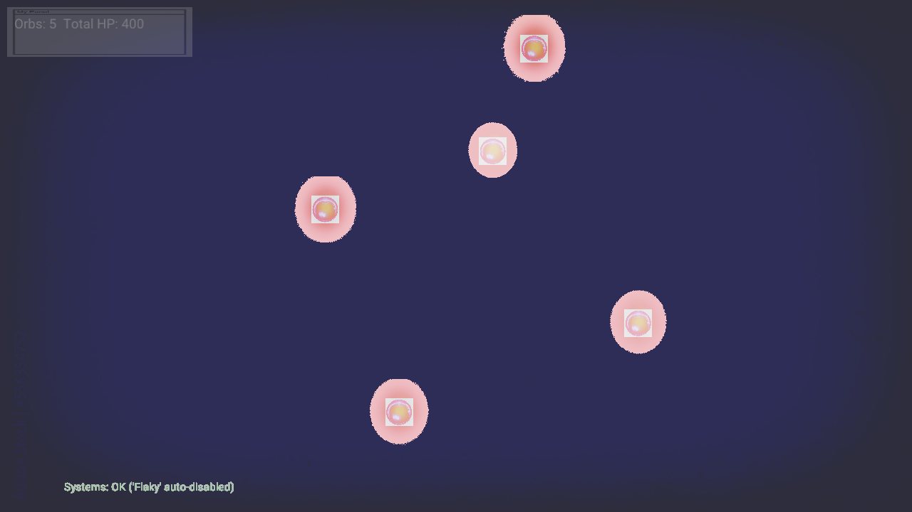
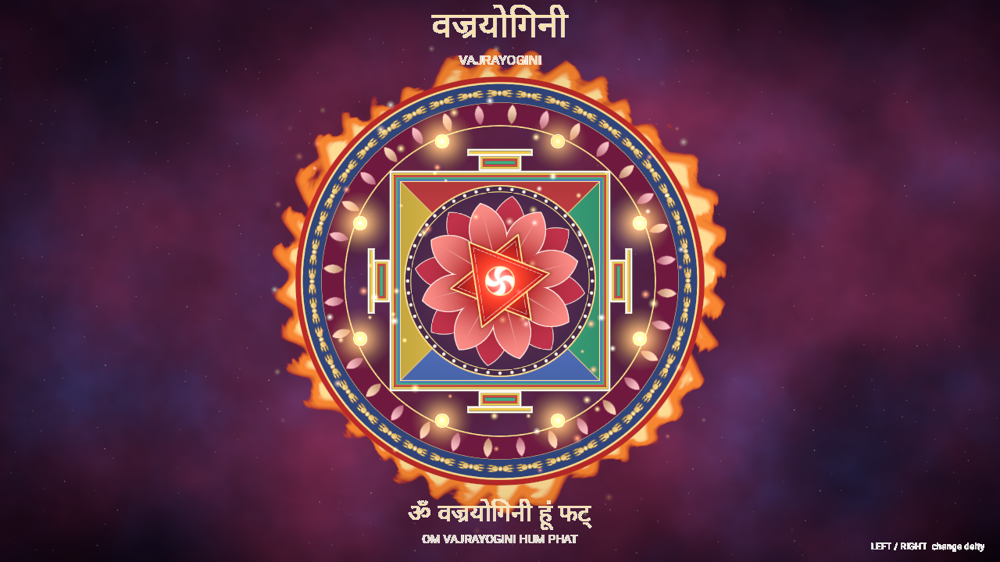

# Python examples

Install the native package using [BUILDING.md](../../BUILDING.md#python-bindings). Each example compiles its own shaders, so `glslc` must be discoverable. Run each from the directory containing its script, JSON, and `shaders/`.

| Directory | Run | Demonstrates |
|---|---|---|
| [getting_started/demo](../../examples/python/getting_started/demo) | `python demo.py` | PBR/IBL scene and facade use |
| [getting_started/ecs_bindings_demo](../../examples/python/getting_started/ecs_bindings_demo) | `python ecs_bindings_demo.py` | Custom Python components and systems |
| [animation/skinned_fox_demo](../../examples/python/animation/skinned_fox_demo) | `python skinned_fox_demo.py` | Skeletal animation |
| [rendering/japanese_shrine](../../examples/python/rendering/japanese_shrine) | `python shrine.py` | Deferred PBR of a downloaded glTF model with IBL, sun shadows, sky and fog |
| [games_2d/sprite_ui_test](../../examples/python/games_2d/sprite_ui_test) | `python sprite_ui_demo.py` | Sprites, panels, and text |
| [games_2d/full_showcase](../../examples/python/games_2d/full_showcase) | `python showcase_demo.py` | Layer masks, blend modes, and script ECS |
| [games_2d/dakini_temple](../../examples/python/games_2d/dakini_temple) | `python temple.py` | Procedural shader layers driven by material parameters and custom scene values |
| [games_2d/pong_game](../../examples/python/games_2d/pong_game) | `python pong.py` | Complete 2D game and capture controls |

Pong's third-party artwork must be obtained separately; follow its [README](../../examples/python/games_2d/pong_game/README.md). Other optional assets and fallback behavior are described in the [shared asset guide](../../assets/README.md). The Fox script has an older comment suggesting the C++ directory; use its own Python directory as listed here.

For a minimal first project, prefer the [generated starter](../getting-started/python-quickstart.md). For pipeline authoring, see [JSON walkthrough](../guides/json-render-pipeline.md).

## Runtime previews

Native frame captures using bundled assets. See [capture recipes and asset choices](../images/examples/README.md) for refresh instructions. Click an image to view it at full resolution.

### Facade demo (`demo`)

The Python facade demo with its bundled `Box.gltf` fallback and active compute particles; optional Sponza is not installed in the shared asset root.

### ECS bindings (`ecs_bindings_demo`)

This example intentionally creates no meshes or sprites. Its custom components and systems run without visible objects; the deliberately failing system reports its auto-disable in the console. The empty viewport is expected, not a loading failure.

### Animated Fox (`skinned_fox_demo`)

Bundled `Fox.glb` during playback of the first animation clip, driven through the Python bindings.

### Japanese shrine (`japanese_shrine`)

The model's glTF metallic-roughness textures go through the same G-buffer shader as Sponza. `shaders/shrine_lighting.frag` then adds image-based light from `farm_sunset_1k.hdr` and a low sun, draws the environment as the sky, and fades distant ground into it. The sun casts shadows: `ShadowPass` renders depth into a fixed 2048×2048 `shadowMap` declared in the pipeline JSON, with hardware slope bias from its `depthBias` block, from an orthographic sun projection that `shrine.py` builds and passes in with `set_custom_mat4`, and the lighting pass filters it with 5×5 PCF. The camera circles the shrine; **Space** stops the orbit for free flight. The model is not in the repository: download it as the [asset guide](../../assets/README.md#not-committed) describes.

Model: "Japanese Shrine - Traditional Temple" (https://skfb.ly/pMEO8) by aumiella, licensed under [Creative Commons Attribution 4.0](http://creativecommons.org/licenses/by/4.0/).

### Sprites and UI (`sprite_ui_test`)

Bundled orb and panel textures with a screen-space score label. The checkerboard around the orb is part of the supplied texture, not an added screenshot background.

### Full showcase (`full_showcase`)

Bundled sprites, layered blend passes, text, and Python ECS systems in motion. The status confirms that the deliberately failing system has auto-disabled.

### Dakini temple (`dakini_temple`)

A mandala palace with no textures. `shaders/mandala.frag` draws each layer onto its quad from a `shape` material parameter, and Python systems turn the rings, make the lotus breathe, flicker the lamps and drift the embers. **Left**/**Right** (or **Space**) dim the palace and bring it back for another deity: Vajrayogini, Green Tara, White Tara or Vajrapani. Each has its own palette, centre symbol and mantra, chosen in the shader through the `scene.custom.deity` value. The preview shows Vajrayogini, the first deity.

The names and mantras are in Devanagari, which the engine's ASCII-only text baking cannot shape. `temple.py` renders them with Pillow's raqm (HarfBuzz) layout and the bundled Noto Sans Devanagari into PNGs under `generated/`, and shows them as screen-space panels that fade with the mandala. Without Pillow + raqm it shows the transliterations as engine text instead.

### Pong (`pong_game`) — preview unavailable

Pong uses separately obtained **Simple Ping Pong Assets by Esoe B.Studios**. The local artwork README provides attribution but no license grant, and the [publisher page](https://myebstudios.itch.io/simple-ping-pong-assets) does not establish permission to publish gameplay captures. The bundled font licenses do not cover that artwork. A screenshot is omitted pending permission; see the [capture record](../images/examples/README.md#pong-artwork-permission).
