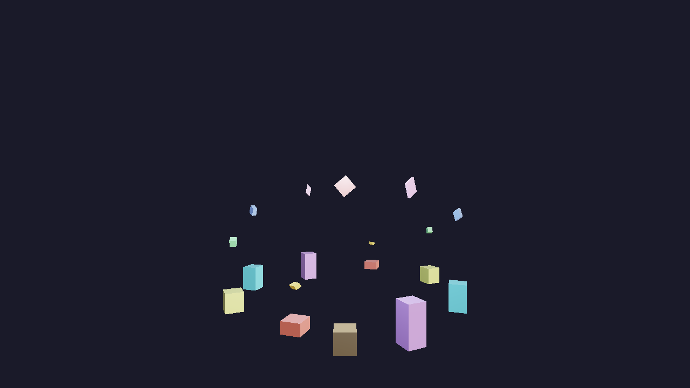
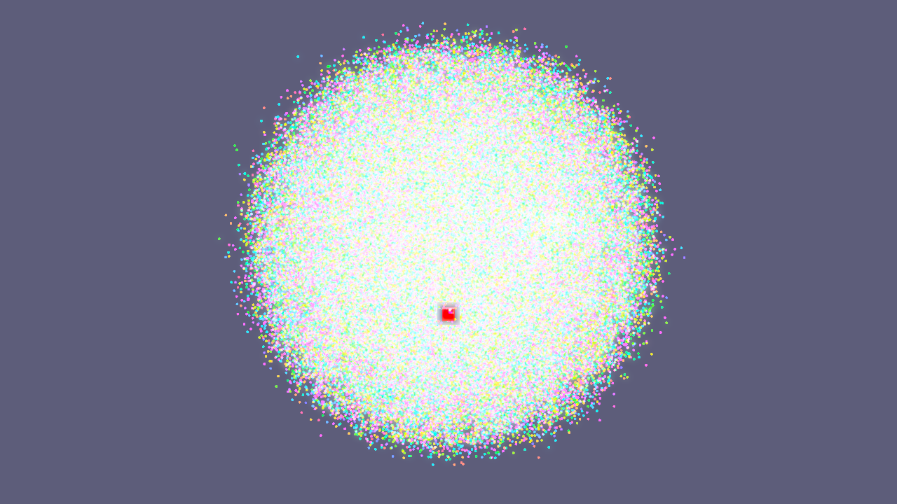

# Examples

Runnable programs, split by language and then by what they show.

```
examples/
  cpp/        built by CMake as part of the main build
  python/     no build step beyond the extension itself
```

Every example runs **from its own directory** — each one loads its pipeline JSON
and shaders by relative path. Models, environment maps and textures come from
the shared asset root (`assets/`), which the engine finds on its own from
anywhere in the tree.

---

## Example gallery

| 3D rendering | Compute particles |
|---|---|
| [](../docs/examples/cpp-examples.md#instancing-instancing_test) | [](../docs/examples/cpp-examples.md#particle-flow-particle_flow_example) |
| Instancing with bundled boxes | Particle flow with the bundled-box fallback |
| **Skeletal animation** | **2D and UI** |
| [](../docs/examples/python-examples.md#animated-fox-skinned_fox_demo) | [](../docs/examples/python-examples.md#full-showcase-full_showcase) |
| Fox animation through Python | Sprites, blend modes, text, and Python ECS |

Browse every preview in the [C++ guide](../docs/examples/cpp-examples.md) and [Python guide](../docs/examples/python-examples.md). These are native runtime captures; the guides explain asset substitutions and the missing Pong preview.

## C++

Built when `-DBUILD_EXAMPLES=ON` (default: `OFF`). Executables land in
`build/examples/cpp/<category>/<name>/`; the target names differ from the
directory names, see [BUILDING.md](../BUILDING.md).

### api — driving the engine

| | |
|---|---|
| [`facade_test`](cpp/api/facade_test) | The smallest complete application. Start here: one `EngineAPI`, a glTF scene, a light, a camera. Falls back to a shipped box if Sponza was never downloaded. |
| [`instancing_test`](cpp/api/instancing_test) | Shared GPU buffers across many instances, glTF node hierarchies kept intact rather than baked, and frame capture. Has a `--selftest` mode that asserts all of it. |

### rendering

| | |
|---|---|
| [`declarative_sponza_test`](cpp/rendering/declarative_sponza_test) | Deferred PBR with image-based lighting, driven entirely from `pbr_ibl_pipeline_v3.json`. The reference for what the JSON frame graph can express. |
| [`bloom_test`](cpp/rendering/bloom_test) | Multi-pass post-processing: bright-pass extraction, separable blur, composite. |

### compute

| | |
|---|---|
| [`particle_test`](cpp/compute/particle_test) | A compute-shader particle system, minimal. |
| [`particle_flow_example`](cpp/compute/particle_flow_example) | The same idea at scale — attractors, pulsing gravity, and a render-target readback that saves an HDR frame to disk. |
| [`ssbo_data_flow_example`](cpp/compute/ssbo_data_flow_example) | GPU→CPU readback and cross-pass buffer sharing, which is the part of the frame graph hardest to see from the outside. |

### physics

| | |
|---|---|
| [`physics_test`](cpp/physics/physics_test) | Rigid bodies and collider setup through the native C++ ECS/physics system. |
| [`pbr_physics_particles`](cpp/physics/pbr_physics_particles) | Everything at once: PBR, IBL, physics and compute particles in one frame. Filed under physics because it has to go somewhere. |

### animation

| | |
|---|---|
| [`skinned_mesh_test`](cpp/animation/skinned_mesh_test) | Skeletal animation from glTF — joints, skins, and clip playback. |

---

## Python

No build step; they need the extension built for the Python you run them with,
and they compile their own shaders at startup via `sk.shaders.compile_dir`.

### getting_started

| | |
|---|---|
| [`demo`](python/getting_started/demo) | The Python counterpart of `facade_test`, going further: a full PBR/IBL scene, physics, and the scene graph. |
| [`ecs_bindings_demo`](python/getting_started/ecs_bindings_demo) | Components and systems written in Python, registered with the engine's ECS. |

### animation

| | |
|---|---|
| [`skinned_fox_demo`](python/animation/skinned_fox_demo) | Loading and playing a skinned glTF animation from Python. |

### games_2d

| | |
|---|---|
| [`pong_game`](python/games_2d/pong_game) | A finished game. Sprites, UI, text, input and a match loop, in one file. |
| [`sprite_ui_test`](python/games_2d/sprite_ui_test) | The pieces pong is built from, one at a time: world-space sprites, anchored UI panels, baked text. |
| [`full_showcase`](python/games_2d/full_showcase) | Three blend modes in one frame via render layer masks, plus custom Python ECS components and systems. |

---

## Assets

Nothing here carries its own copy of a model or environment map. They live in
[`assets/`](../assets), and `tools/fetch_assets.py` downloads the large optional
ones. Two exceptions, both third-party art that is not redistributed here:

- `pong_game/assets/` — see its `pong-game-assets-link.txt`.
- Sponza, used by several examples, which they fall back gracefully without.
